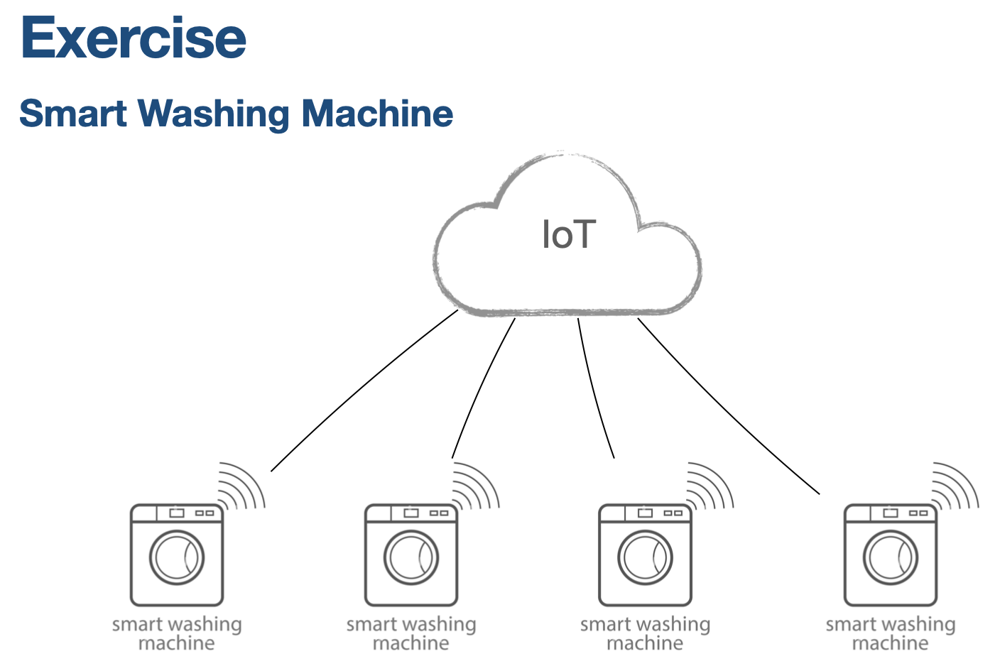

## Get hardware level operations e.g. wash_count
```
Topic: v1cdti/hw/get/6420301002/model-01/WSH-SN001
Payload: {
    "action"    : "get",
    "project"   : "6420301002",
    "model"     : "model-01",
    "serial"    : "WSH-SN001",
    "name"      : "wash_count",
    "value"     : "126"
}
```

## Get firmware version
```
Topic: v1cdti/hw/get/6420301002/model-01/WSH-SN001
Payload: {
    "action"    : "get",
    "project"   : "6420301002",
    "model"     : "model-01",
    "serial"    : "WSH-SN001",
    "name"      : "firmware",
    "value"     : "1.0"
}
```

## Get manufacture id and geo-location or location placement
```
Topic: v1cdti/hw/get/6420301002/model-01/WSH-SN001
Payload: {
    "action"        : "get",
    "project"       : "6420301002",
    "model"         : "model-01",
    "serial"        : "WSH-SN001",
    "name"          : "manufacture id",
    "value"         : "20010412",
    "name"          : "geo-location",
    "value"         : "118.7942459,98.9564772",
    "name"          : "location",
    "value"         : "Chiang-mai"
}
```

## Set geo-location or location placement
```
Topic: v1cdti/hw/set/6420301002/model-01/WSH-SN001
Payload: {
    "action"        : "set",
    "project"       : "6420301002",
    "model"         : "model-01",
    "serial"        : "WSH-SN001",
    "name"          : "geo-location",
    "value"         : "19.9165964,99.7970673",
    "name"          : "location",
    "value"         : "Chiang-rai"
}
```

## Monitor machine sensor
```
Topic: v1cdti/hw/monitor/6420301002/model-01/WSH-SN002
Payload: {
    "action"    : "monitor",
    "project"   : "6420301002",
    "model"     : "model-01",
    "serial"    : "WSH-SN002",
    "name"      : "Temp",
    "value"     : "45",
    "name"      : "Bubble",
    "value"     : "30",
    "name"      : "Weight",
    "value"     : "18",
    "name"      : "Quality",
    "value"     : "513",
    "name"      : "Level",
    "value"     : "70"
}
```

## Set machie status to "maint" to indicate this machine need to be maintenance.
```
Topic: v1cdti/hw/set/6420301002/model-01/WSH-SN001
Payload: {
    "action"    : "set",
    "project"   : "6420301002",
    "model"     : "model-01",
    "serial"    : "WSH-SN001",
    "name"      : "status",
    "value"     : "maint"
}
```